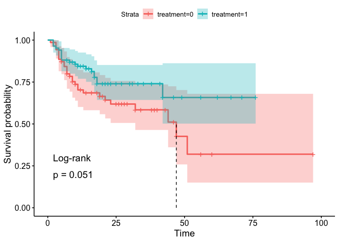

P8110 - Applied Regression II - Homework \#3
================

``` r
library(survival)
library(survminer)
library(tidyverse)
```

The ”HW3Data” gives the time until staphylococcus infection (in days)
for 154 patients with a burn wound. The purpose of this study was to
compare a routine bathing care treatment with a body-cleansing method.
The time until staphylococcus infection was recorded, along with an
indicator variable – whether or not an infection had occurred. The
severity of the burn was measured by percentage of total surface area of
body burned.

| variable            | description                                             |
|---------------------|---------------------------------------------------------|
| id                  | patient id                                              |
| treatment           | 0 = routine bathing <br> 1 = body cleansing             |
| pct\_burned         | percentage of total surface area burned                 |
| time\_to\_infection | time to staphylocous aureaus infection or on study time |
| infection           | 0 = infection did not occur <br> 1 = infection occurred |

------------------------------------------------------------------------

### Question 1

Use R to compute the Kaplan-Meier estimator and 95% CI of the survival
function for the routine bathing group, and also for the body-cleansing
group (only keep the K-M estimates for unique event time points).
Generate a graph of the survival functions in the two treatment groups.
Interpret the graph. (*Hint: What do you observe about the difference of
the survival functions between the two groups?*)

``` r
hw3_data <- read_csv("./data/hw3_data.csv",
                     col_names = c("id", "treatment", "pct_burned", "time_to_infection", "infection"))

hw3_data
```

    ## # A tibble: 154 x 5
    ##       id treatment pct_burned time_to_infection infection
    ##    <dbl>     <dbl>      <dbl>             <dbl>     <dbl>
    ##  1     1         0         15                12         0
    ##  2     2         0         20                 9         0
    ##  3     3         0         15                 7         1
    ##  4     4         0         20                29         0
    ##  5     5         0         70                 4         1
    ##  6     6         0         20                 8         1
    ##  7     7         0          5                11         1
    ##  8     8         0         30                 4         1
    ##  9     9         0         25                 4         1
    ## 10    10         0         20                 7         0
    ## # … with 144 more rows

#### Estimate the survival curve

``` r
q1_fit <- survfit(Surv(time = time_to_infection, event = infection) ~ treatment, data = hw3_data)
```

#### Kaplan-Meier Estimators

##### Routine Bathing Group

``` r
q1_fit %>% 
    broom::tidy() %>% 
    filter(strata == "treatment=0") %>% 
    knitr::kable(digits = 5) %>% 
    print(n = Inf)
```

    ## 
    ## 
    ## | time| n.risk| n.event| n.censor| estimate| std.error| conf.high| conf.low|strata      |
    ## |----:|------:|-------:|--------:|--------:|---------:|---------:|--------:|:-----------|
    ## |    1|     70|       1|        0|  0.98571|   0.01439|   1.00000|  0.95830|treatment=0 |
    ## |    3|     69|       3|        0|  0.94286|   0.02942|   0.99883|  0.89002|treatment=0 |
    ## |    4|     66|       4|        0|  0.88571|   0.04293|   0.96347|  0.81423|treatment=0 |
    ## |    5|     62|       1|        1|  0.87143|   0.04591|   0.95348|  0.79644|treatment=0 |
    ## |    6|     60|       2|        0|  0.84238|   0.05179|   0.93238|  0.76107|treatment=0 |
    ## |    7|     58|       3|        2|  0.79881|   0.06019|   0.89883|  0.70992|treatment=0 |
    ## |    8|     53|       1|        2|  0.78374|   0.06313|   0.88697|  0.69252|treatment=0 |
    ## |    9|     50|       2|        1|  0.75239|   0.06942|   0.86205|  0.65668|treatment=0 |
    ## |   10|     47|       1|        2|  0.73638|   0.07267|   0.84911|  0.63862|treatment=0 |
    ## |   11|     44|       2|        0|  0.70291|   0.07977|   0.82187|  0.60117|treatment=0 |
    ## |   12|     42|       0|        2|  0.70291|   0.07977|   0.82187|  0.60117|treatment=0 |
    ## |   13|     40|       1|        0|  0.68534|   0.08370|   0.80750|  0.58165|treatment=0 |
    ## |   14|     39|       0|        1|  0.68534|   0.08370|   0.80750|  0.58165|treatment=0 |
    ## |   16|     38|       0|        3|  0.68534|   0.08370|   0.80750|  0.58165|treatment=0 |
    ## |   18|     35|       0|        2|  0.68534|   0.08370|   0.80750|  0.58165|treatment=0 |
    ## |   19|     33|       1|        1|  0.66457|   0.08917|   0.79149|  0.55800|treatment=0 |
    ## |   20|     31|       0|        1|  0.66457|   0.08917|   0.79149|  0.55800|treatment=0 |
    ## |   21|     30|       1|        2|  0.64242|   0.09540|   0.77450|  0.53286|treatment=0 |
    ## |   23|     27|       1|        0|  0.61862|   0.10260|   0.75641|  0.50594|treatment=0 |
    ## |   25|     26|       0|        1|  0.61862|   0.10260|   0.75641|  0.50594|treatment=0 |
    ## |   26|     25|       0|        1|  0.61862|   0.10260|   0.75641|  0.50594|treatment=0 |
    ## |   27|     24|       0|        1|  0.61862|   0.10260|   0.75641|  0.50594|treatment=0 |
    ## |   28|     23|       0|        2|  0.61862|   0.10260|   0.75641|  0.50594|treatment=0 |
    ## |   29|     21|       0|        3|  0.61862|   0.10260|   0.75641|  0.50594|treatment=0 |
    ## |   32|     18|       1|        2|  0.58425|   0.11745|   0.73548|  0.46412|treatment=0 |
    ## |   34|     15|       0|        1|  0.58425|   0.11745|   0.73548|  0.46412|treatment=0 |
    ## |   38|     14|       0|        1|  0.58425|   0.11745|   0.73548|  0.46412|treatment=0 |
    ## |   39|     13|       0|        2|  0.58425|   0.11745|   0.73548|  0.46412|treatment=0 |
    ## |   40|     11|       0|        1|  0.58425|   0.11745|   0.73548|  0.46412|treatment=0 |
    ## |   43|     10|       0|        2|  0.58425|   0.11745|   0.73548|  0.46412|treatment=0 |
    ## |   44|      8|       1|        0|  0.51122|   0.17791|   0.72451|  0.36072|treatment=0 |
    ## |   46|      7|       0|        1|  0.51122|   0.17791|   0.72451|  0.36072|treatment=0 |
    ## |   47|      6|       1|        1|  0.42602|   0.25492|   0.70213|  0.25849|treatment=0 |
    ## |   51|      4|       1|        0|  0.31951|   0.38512|   0.67968|  0.15020|treatment=0 |
    ## |   56|      3|       0|        1|  0.31951|   0.38512|   0.67968|  0.15020|treatment=0 |
    ## |   60|      2|       0|        1|  0.31951|   0.38512|   0.67968|  0.15020|treatment=0 |
    ## |   97|      1|       0|        1|  0.31951|   0.38512|   0.67968|  0.15020|treatment=0 |

##### Body-Cleansing Group

``` r
q1_fit %>% 
    broom::tidy() %>% 
    filter(strata == "treatment=1") %>% 
    knitr::kable(digits = 5) %>% 
    print(n = Inf)
```

    ## 
    ## 
    ## | time| n.risk| n.event| n.censor| estimate| std.error| conf.high| conf.low|strata      |
    ## |----:|------:|-------:|--------:|--------:|---------:|---------:|--------:|:-----------|
    ## |    2|     84|       3|        0|  0.96429|   0.02100|   1.00000|  0.92541|treatment=1 |
    ## |    3|     81|       1|        0|  0.95238|   0.02440|   0.99903|  0.90791|treatment=1 |
    ## |    4|     80|       1|        0|  0.94048|   0.02745|   0.99246|  0.89122|treatment=1 |
    ## |    5|     79|       5|        0|  0.88095|   0.04011|   0.95300|  0.81435|treatment=1 |
    ## |    7|     74|       0|        1|  0.88095|   0.04011|   0.95300|  0.81435|treatment=1 |
    ## |    8|     73|       1|        1|  0.86888|   0.04241|   0.94420|  0.79957|treatment=1 |
    ## |    9|     71|       0|        1|  0.86888|   0.04241|   0.94420|  0.79957|treatment=1 |
    ## |   10|     70|       1|        1|  0.85647|   0.04479|   0.93506|  0.78449|treatment=1 |
    ## |   11|     68|       1|        2|  0.84388|   0.04718|   0.92562|  0.76935|treatment=1 |
    ## |   12|     65|       0|        3|  0.84388|   0.04718|   0.92562|  0.76935|treatment=1 |
    ## |   13|     62|       0|        5|  0.84388|   0.04718|   0.92562|  0.76935|treatment=1 |
    ## |   14|     57|       1|        5|  0.82907|   0.05039|   0.91513|  0.75111|treatment=1 |
    ## |   15|     51|       0|        1|  0.82907|   0.05039|   0.91513|  0.75111|treatment=1 |
    ## |   16|     50|       1|        2|  0.81249|   0.05429|   0.90371|  0.73048|treatment=1 |
    ## |   17|     47|       2|        4|  0.77792|   0.06239|   0.87910|  0.68838|treatment=1 |
    ## |   18|     41|       2|        2|  0.73997|   0.07172|   0.85165|  0.64294|treatment=1 |
    ## |   20|     37|       0|        2|  0.73997|   0.07172|   0.85165|  0.64294|treatment=1 |
    ## |   21|     35|       0|        3|  0.73997|   0.07172|   0.85165|  0.64294|treatment=1 |
    ## |   22|     32|       0|        4|  0.73997|   0.07172|   0.85165|  0.64294|treatment=1 |
    ## |   23|     28|       0|        3|  0.73997|   0.07172|   0.85165|  0.64294|treatment=1 |
    ## |   25|     25|       0|        1|  0.73997|   0.07172|   0.85165|  0.64294|treatment=1 |
    ## |   27|     24|       0|        1|  0.73997|   0.07172|   0.85165|  0.64294|treatment=1 |
    ## |   30|     23|       0|        2|  0.73997|   0.07172|   0.85165|  0.64294|treatment=1 |
    ## |   31|     21|       0|        4|  0.73997|   0.07172|   0.85165|  0.64294|treatment=1 |
    ## |   33|     17|       0|        1|  0.73997|   0.07172|   0.85165|  0.64294|treatment=1 |
    ## |   35|     16|       0|        2|  0.73997|   0.07172|   0.85165|  0.64294|treatment=1 |
    ## |   38|     14|       0|        3|  0.73997|   0.07172|   0.85165|  0.64294|treatment=1 |
    ## |   41|     11|       0|        2|  0.73997|   0.07172|   0.85165|  0.64294|treatment=1 |
    ## |   42|      9|       1|        1|  0.65775|   0.13796|   0.86197|  0.50192|treatment=1 |
    ## |   46|      7|       0|        1|  0.65775|   0.13796|   0.86197|  0.50192|treatment=1 |
    ## |   49|      6|       0|        1|  0.65775|   0.13796|   0.86197|  0.50192|treatment=1 |
    ## |   56|      5|       0|        1|  0.65775|   0.13796|   0.86197|  0.50192|treatment=1 |
    ## |   62|      4|       0|        1|  0.65775|   0.13796|   0.86197|  0.50192|treatment=1 |
    ## |   67|      3|       0|        1|  0.65775|   0.13796|   0.86197|  0.50192|treatment=1 |
    ## |   71|      2|       0|        1|  0.65775|   0.13796|   0.86197|  0.50192|treatment=1 |
    ## |   76|      1|       0|        1|  0.65775|   0.13796|   0.86197|  0.50192|treatment=1 |

##### Survival Curve Plot

``` r
ggsurvplot(q1_fit, conf.int = TRUE)
```

<!-- -->
